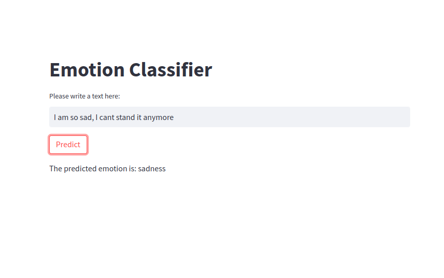

# Emotion Detector NLP Project

This project leverages Natural Language Processing (NLP) techniques and Machine Learning (ML) algorithms to build an Emotion Detection model capable of identifying various emotions from a given text. The emotions classified by this model include Neutral, Joy, Sadness, Fear, Surprise, Anger, Shame, and Disgust.

## Data
The model is trained on a labeled dataset comprising of text and corresponding emotions. The labeled dataset provided rich information for the model to learn from during the training process.

## Project Structure

### Data Cleaning
The first step of this project is the cleaning of the data. We've developed a Python function for this purpose. This function eliminates special characters and irregularities from the text, performs stemming, and standardizes the text to ensure that the model gets clean, consistent data to learn from.

### Model Development
After cleaning the data, we utilize the Scikit-Learn's `Pipeline` feature to streamline the machine learning workflow. The pipeline includes the following steps:

1. **CountVectorizer**: This is used to transform the text data into a format that can be understood by the machine learning algorithm. It converts our collection of text data into a matrix of token counts.
2. **LogisticRegression**: This is the Machine Learning algorithm used to predict the emotions based on the text. It is a statistical model that uses a logistic function to model a binary dependent variable.
### Model Deployment
After training and testing, the model is saved and deployed as a web application, providing a user-friendly interface for users to input text and get corresponding emotion predictions in return.

## How to Use
To use this model, input a sentence or a piece of text into the web application. The model will analyze the text and output the detected emotion.

## Future Work
This is an ongoing project and we are continually working to improve the model's accuracy and efficiency. Future enhancements may include use of different machine learning algorithms, application of more advanced NLP techniques, and expansion of the emotion categories. Stay tuned for updates!

## License
This project is licensed under the MIT License.

## Contribution
Pull requests are welcome. For major changes, please open an issue first to discuss what you would like to change. Please make sure to update tests as appropriate.